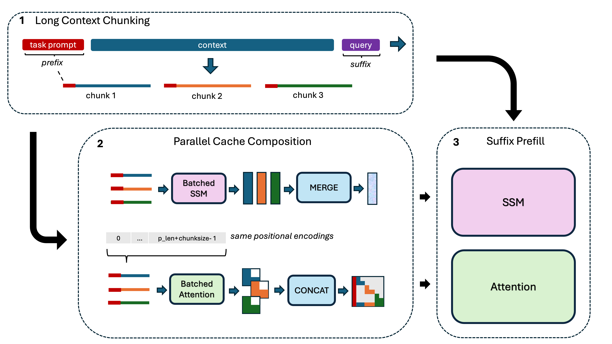

# State Composition

Hybrid Model Factory includes experimental support for training-free context extension via state composition. Instead of processing an entire long input in a single pass, state composition partitions the context into smaller chunks, processes each chunk independently, and merges the resulting KV caches and SSM states at inference time. This lets models handle 2–4× their context length with no additional training.

> **Note:** State composition is experimental. The API and supported composition strategies may change in future updates.

This document covers:
- [Why state composition?](#why-state-composition)
- [How it works](#how-it-works)
- [Quick start](#quick-start)
- [Recommended settings](#recommended-settings)
- [Running the NIAH example](#running-the-niah-example)
- [Composition strategies](#composition-strategies)

---

## Why State Composition?

As context length grows beyond a model's native training window, quality degrades and memory costs increase. Approaches like YaRN can extrapolate position embeddings, but they require careful tuning and do not directly apply to hybrid models.

Both Transformers and Hybrids can, in principle, chunk and merge context before generation (e.g. sparse Transformers from [Child et al. 2019](https://arxiv.org/pdf/1904.10509)). However, SSM layers make this substantially easier: their fixed-size recurrent states can be combined (averaged, fused, or summed) in a theoretically principled way that stays close to the original training distribution. In contrast, merging KV caches from independently processed chunks introduces out-of-distribution attention patterns that are harder to control in pure Transformer architectures.

We support several composition strategies depending on the SSM layer type (see [Composition Strategies](#composition-strategies)). Using these strategies, our hybrid models can extend beyond their native context length. The table below shows how state composition improves HELMET scores up to 4x our GKA 8B model's native context window.

### HELMET Evaluation Results

Aggregate scores on [HELMET](https://github.com/princeton-nlp/HELMET) (excluding summarization task) for different GKA-8B models when using `concat_kv_soup_ssm` setting:

| Method | Native Context | @64k | @128k |
|--------|---------------|------|-------|
| GKA-primed-HQwen3-8B-Stage1 | ~32k | 36.22 | 7.20 |
| &nbsp;&nbsp;w/ State Composition (chunk size 32k) | | 41.80 | 34.50 |
| GKA-primed-HQwen3-8B-Instruct | ~128k | 48.95 | 41.68 |
| &nbsp;&nbsp;w/ State Composition (chunk size 64k) | | — | 46.07 |
| GKA-primed-HQwen3-8B-Reasoner | ~128k | 47.12 | 38.81 |
| &nbsp;&nbsp;w/ State Composition (chunk size 64k) | | — | 44.86 |


---

## How It Works

The figure below shows the high-level flow, traced through a needle-in-a-haystack (NIAH) example. Given these inputs:

```
prefix:  "A special number is hidden in the following text, make sure to memorize it"

context: "One of the special magic numbers for grubby-counter is: 5311001.\nOne of..."

suffix:  "What is the special magic number for cynical-spotlight mentioned in the provided text?"
```

The process is:

1. The context is partitioned into equal-sized chunks and the prefix is appended to each.
2. Each chunk is processed independently (batched prefill), and the states are merged according to the chosen composition strategy. KV caches are concatenated so that only the first copy of the prefix is maintained.
3. The final query is prefilled as normal starting from the merged hybrid state.



---

## Quick Start

```python
from transformers import AutoModelForCausalLM, AutoTokenizer
import hmf.model.hybrid_zoo.models.model_register  # Register Hybrid models
from hmf.model.hybrid_zoo.models.cache_compose import wrap_for_composition

model = AutoModelForCausalLM.from_pretrained(model_path, dtype="auto", device_map="auto", trust_remote_code=True)
tokenizer = AutoTokenizer.from_pretrained(model_path, trust_remote_code=True)

# Wrap model with CacheComposerMixin (also sets config.newline_token_id from the tokenizer)
composer_model = wrap_for_composition(model, tokenizer)

# Set custom generation kwargs
cache_compose_args = {
    "compose_type": "concat_kv_soup_ssm",  # Composition strategy (see below)
    "num_chunks": 4,                        # Number of equal-sized chunks
    "sequential_positions": False,          # Independent position IDs per chunk
    "prefix_input_ids": task_prompt_ids,    # Tokens to prepend to every chunk (e.g. system prompt)
    "suffix_input_ids": question_ids,       # Query tokens to prefill before generation
}

outputs = composer_model.generate(
    input_ids=input_ids,
    max_new_tokens=20,
    do_sample=False,
    use_cache=True,
    **cache_compose_args,
)
```

> **Note on `input_ids`:** The suffix/query tokens (e.g. `question_ids`) must appear both
> at the tail of `input_ids` *and* in `suffix_input_ids`. The mixin uses `suffix_input_ids`
> only to determine how many tokens to split off as the query, then slices them from
> `input_ids` directly. Chat template application (e.g. `tokenizer.apply_chat_template()`)
> is not currently supported; pass raw token IDs without chat formatting.

---

## Recommended Settings

For most use cases, the following combination gives strong performance:

- `compose_type="concat_kv_soup_ssm"` — concatenated KV cache with averaged SSM states
- `sequential_positions=False` — each chunk gets independent position IDs starting from 0
- Pass `prefix_input_ids` (e.g. a system/task prompt) so every chunk shares the same prefix context
- Pass `suffix_input_ids` (the query portion) so it is prefilled token-by-token after composition

This mirrors the configuration used in the NIAH evaluation example (see below).

---

## Running the NIAH Example

A ready-to-run evaluation script is provided at `training/tests/state_compose/niah_example.py`:

```bash
python training/tests/state_compose/niah_example.py \
    --model /path/to/hybrid/model \
    --num_chunks 4 \
    --compose_type concat_kv_soup_ssm
```

The script loads a needle-in-a-haystack context from `niah_context.txt`, splits it into chunks,
composes the cache, and evaluates retrieval accuracy across several queries. Run with `--help`
to see all available `--compose_type` choices.

Using the 8B instruction-tuned models provided in this release with `concat_kv_soup_ssm`,
this test script achieves 100% retrieval accuracy up to 8 chunks for Mamba2, Gated DeltaNet,
and Gated Kalman Net architectures. GKA models maintain ~80% accuracy at 16 chunks.

---

## Composition Strategies

The `compose_type` argument selects a combination of KV cache strategy and SSM state
combination strategy, formatted as `{kv}_{ssm}`:

| compose_type | KV strategy | SSM strategy | Description |
|---|---|---|---|
| `full_kv_only` | full | kv_only | Full KV cache, zeroed SSM states |
| `full_kv_fuse_ssm` | full | fuse | Full KV cache, context-weighted SSM states |
| `full_kv_soup_ssm` | full | soup | Full KV cache, averaged SSM states |
| `concat_kv_only` | concat | kv_only | Concatenated KV, zeroed SSM states |
| `concat_kv_fuse_ssm` | concat | fuse | Concatenated KV, context-weighted SSM states |
| `concat_kv_soup_ssm` | concat | soup | Concatenated KV, averaged SSM states |
| `sw_kv_only` | sw | kv_only | Sliding window KV, zeroed SSM states |
| `sw_fuse_ssm` | sw | fuse | Sliding window KV, context-weighted SSM states |
| `sw_soup_ssm` | sw | soup | Sliding window KV, averaged SSM states |

**KV cache strategies:**
- **full** — Single concatenated forward pass retaining all KV entries. Most accurate, highest memory.
- **concat** — Chunks processed independently in a batch, then KV entries concatenated (excluding padding). Good accuracy/memory tradeoff.
- **sw** — Sliding window: keeps only the shared prefix and last chunk's KV cache. Lowest memory.

**SSM state combination strategies:**
- **fuse** — Weighted combination using PICASO coefficients (Mamba2) or additive combination of information vectors (GKA/GDN). See [PICASO](https://arxiv.org/abs/2502.17605).
- **soup** — Averaging of SSM states across chunks.
- **kv_only** — Zero out all SSM states; rely solely on the KV cache.
